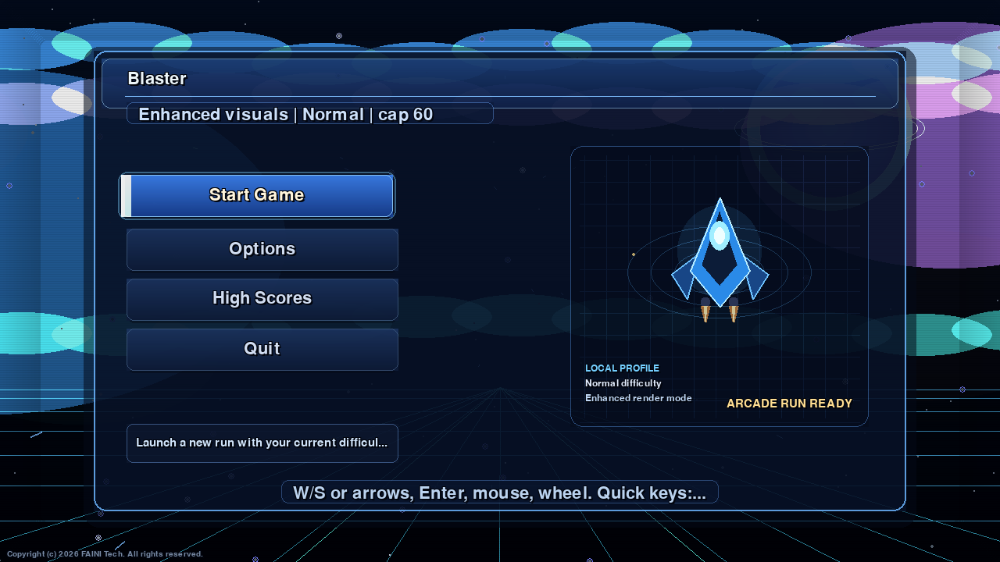
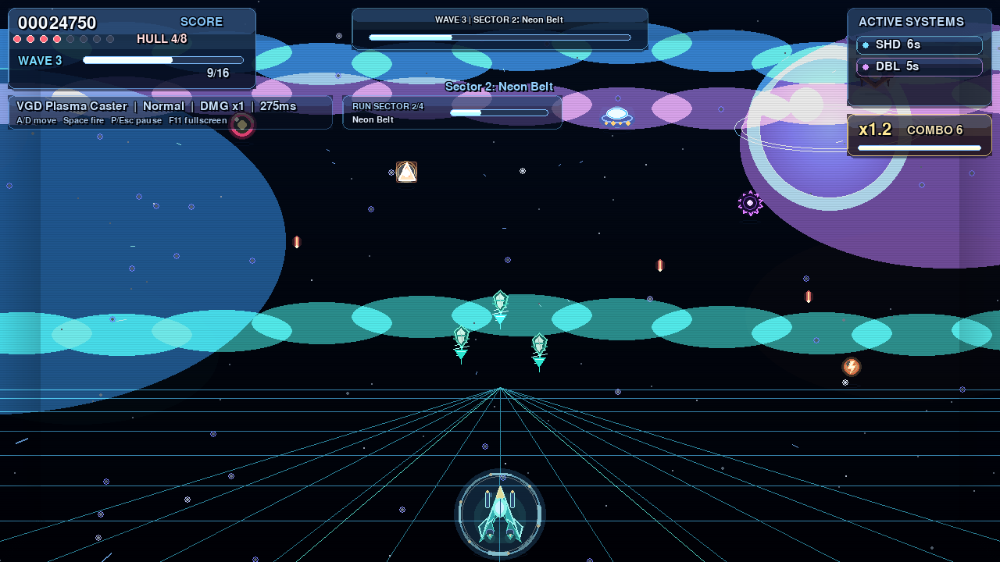
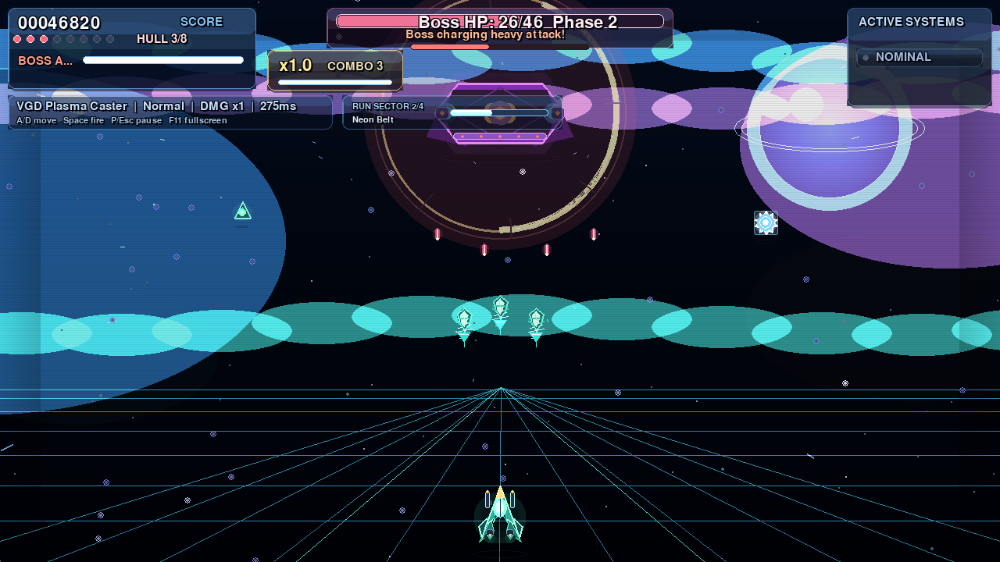

# Blaster

Arcade 2D shooter built with Pygame.

## What Is In This Build

- Polished animated main menu and pause menu
- Adaptive options UI with mouse + keyboard support
- 16:9 scaled playfield (`1280x720`) for modern displays
- Visual quality presets: `Performance`, `Balanced`, `Cinematic`, `Enhanced`
- Default borderless fullscreen with preserved 16:9 aspect ratio (`F11` or Options)
- FPS cap control and optional FPS counter
- Local ship frame selection: `Interceptor`, `Vanguard`, `Lancer`
- Distinct local weapon profiles: twin pulse, plasma caster, rail lance
- Local Run Mode foundation: 8-wave offline operation split into visual sectors
- Balanced modern space backdrop with depth stars, subdued orbital detail, perspective grid, and sprite shadows
- Cinematic depth-entry attack runs for regular enemies
- Wave progression with special enemies and boss phases
- Death replay (5 seconds, skippable)
- Local high scores stored in the user's app data directory
- Persistent user settings with migration from older `data/*.json` files
- Custom Windows executable and window icon

## Screenshots





These screenshots are captured from the actual Pygame renderer:

```powershell
python tools\capture_readme_screenshots.py
```

## Controls

- `A / D` or `Left / Right` - move
- `Space` - shoot
- `P` or `Esc` - pause/resume
- `F11` - fullscreen toggle
- `F3` - FPS counter on/off
- `1 / 2 / 3` - switch difficulty during gameplay

## Download Ready Build (Windows)

Use the **Releases** page and download the latest `Blaster-windows-x64.zip`.

Inside archive:

- `Blaster.exe`
- `README.md`
- `LICENSE`
- `COPYRIGHT`
- `CHANGELOG.md`

## Run From Source

```powershell
python -m venv .venv
.\.venv\Scripts\Activate.ps1
pip install -r requirements.txt
python run_game.py
```

## Tests

```powershell
pytest -q
```

## User Data

Runtime settings and high scores are stored outside the source tree:

- Windows: `%APPDATA%\Blaster`
- macOS: `~/Library/Application Support/Blaster`
- Linux: `$XDG_DATA_HOME/blaster` or `~/.local/share/blaster`

Existing `data/settings.json` and `data/highscores.json` files are treated as legacy data and migrated on first run when no user-data file exists yet.

## Build Release (.exe + .zip)

Use script:

```powershell
.\scripts\build_release.ps1
```

It will:

1. install build dependencies
2. run tests
3. build `Blaster.exe` with PyInstaller and embed the app icon
4. assemble release files
5. create `release/Blaster-windows-x64.zip`

## Notes

- Main entrypoint is `run_game.py`.
- `blaster_game.py` is an old prototype file and is not used for current gameplay.
- Current development target is the Python/Pygame version. Any Godot or Unity work should live in a separate future project.

## Legal

This project is proprietary. All rights reserved.

See `LICENSE` and `COPYRIGHT` for terms.
